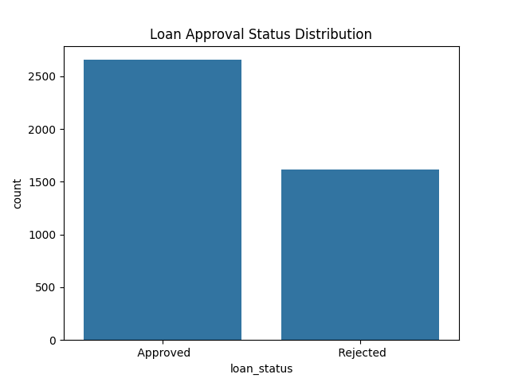
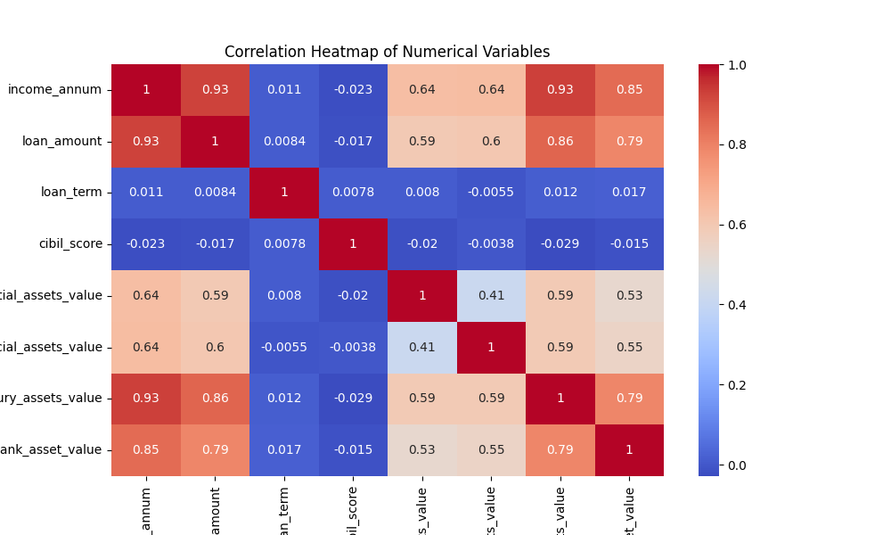
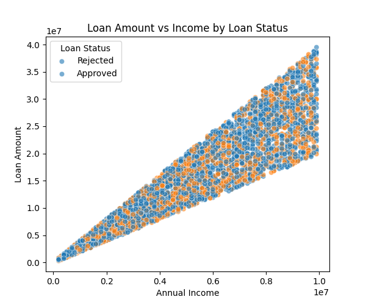
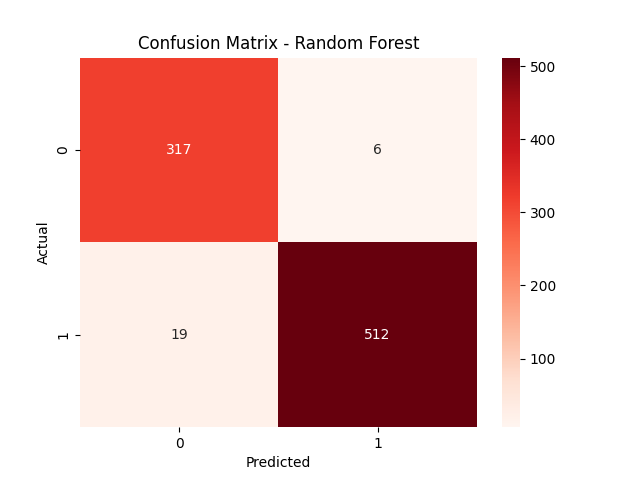
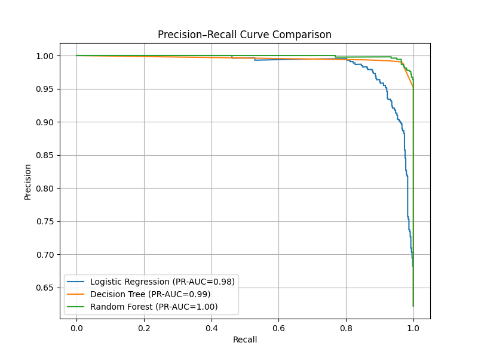
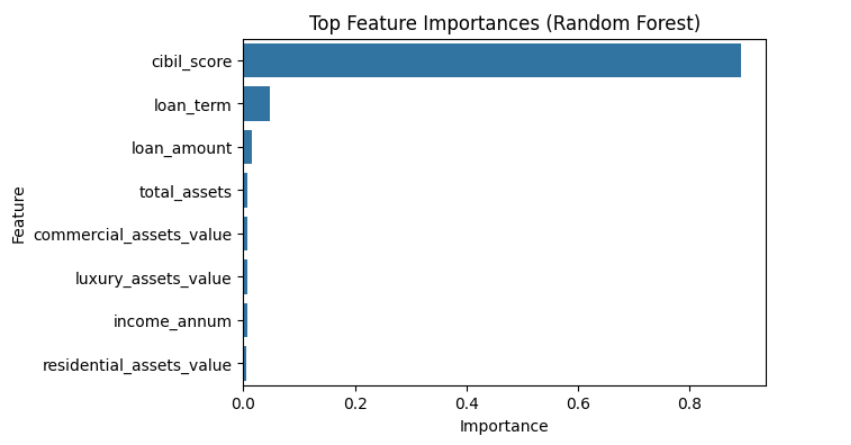

# Loan Approval Prediction & Risk Assessment

Machine learning and predictive analytics project focused on loan approval prediction, financial risk assessment, and applicant behavior analysis using classification models and data-driven insights.

---

# 📊 Project Overview

This project focuses on predicting loan approval outcomes using machine learning techniques and applicant financial data. The objective was to analyze applicant characteristics, identify factors influencing loan approval decisions, and build predictive models capable of assisting financial institutions in loan risk assessment and decision-making.

The project combines exploratory data analysis, feature engineering, classification modeling, model evaluation, and interpretability techniques to generate actionable insights for loan approval and financial risk management.

---

# 🎯 Objectives

* Analyze applicant financial and demographic characteristics
* Identify factors influencing loan approval decisions
* Build predictive machine learning models for loan approval classification
* Compare model performance using evaluation metrics
* Generate interpretable business insights from predictive models
* Support financial risk assessment using data-driven approaches

---

# 🗂️ Dataset

### Dataset Features

The dataset contains information related to:

* Applicant income
* Loan amount
* Loan term
* CIBIL score
* Total assets
* Employment information
* Loan approval status

### Problem Type

Binary classification problem:

* Approved
* Rejected

---

# 🛠️ Technologies Used

* Python
* Pandas
* NumPy
* Matplotlib
* Seaborn
* Scikit-learn

---

# ⚙️ Methodology

## 1. Data Cleaning & Preprocessing

The dataset was preprocessed by:

* Handling missing values
* Encoding categorical variables
* Scaling numerical variables
* Detecting outliers
* Preparing features for machine learning models

---

## 2. Exploratory Data Analysis (EDA)

Performed exploratory analysis to understand:

* Applicant financial behavior
* Loan approval trends
* Feature relationships
* Variable distributions
* Risk-related patterns

---

## 3. Financial Pattern Analysis

Analyzed relationships between:

* Income and loan amount
* Asset ownership and loan status
* CIBIL score and approval probability
* Financial indicators and risk behavior

---

## 4. Machine Learning Models

The following classification models were implemented and compared:

* Logistic Regression
* Decision Tree Classifier
* Random Forest Classifier

The models were evaluated based on:

* Accuracy
* Precision
* Recall
* F1-score
* Precision-Recall performance

---

## 5. Model Evaluation

The Random Forest model demonstrated strong predictive capability in distinguishing approved and rejected loan applications.

Evaluation techniques included:

* Confusion Matrix
* Precision-Recall Analysis
* Classification Metrics

---

## 6. Feature Importance Analysis

Feature importance analysis was conducted to identify variables that contributed most significantly to loan approval prediction.

Key influential features included:

* Applicant income
* CIBIL score
* Loan amount
* Asset ownership indicators

---

# 📈 Key Insights

* Applicant income and CIBIL score showed strong influence on loan approval outcomes.
* Financial stability indicators significantly affected approval probability.
* Loan amount and repayment capacity demonstrated important relationships with approval decisions.
* Ensemble models such as Random Forest provided strong classification performance.
* Feature importance analysis improved interpretability of model predictions.

---

# 💼 Business Applications

The insights generated from this project can support:

* Loan risk assessment
* Credit approval systems
* Financial decision-making
* Applicant profiling
* Automated loan screening systems
* Banking and fintech analytics workflows

---

# 📊 Visualizations Included

* Loan Approval Status Distribution
* Correlation Heatmap
* Loan Amount vs Income Analysis
* Confusion Matrix
* Precision-Recall Curve
* Feature Importance Analysis

---

# 🚀 Future Improvements

Potential future enhancements include:

* Hyperparameter optimization
* XGBoost and LightGBM implementation
* Explainable AI techniques (SHAP/LIME)
* Real-time loan approval systems
* Interactive dashboard deployment
* Deep learning-based credit risk modeling

---

# ✅ Conclusion

This project demonstrates how machine learning and predictive analytics techniques can be applied to financial and applicant data to support loan approval prediction and credit risk assessment. By integrating exploratory data analysis, classification modeling, feature importance analysis, and model evaluation techniques, the project provides a structured framework for understanding financial risk patterns and approval behavior.

The analysis highlights the importance of interpretable and data-driven decision-making systems in improving efficiency, consistency, and risk management within financial institutions.

